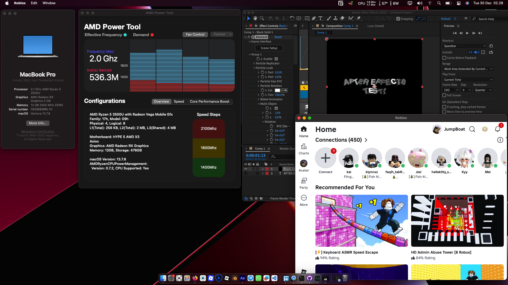
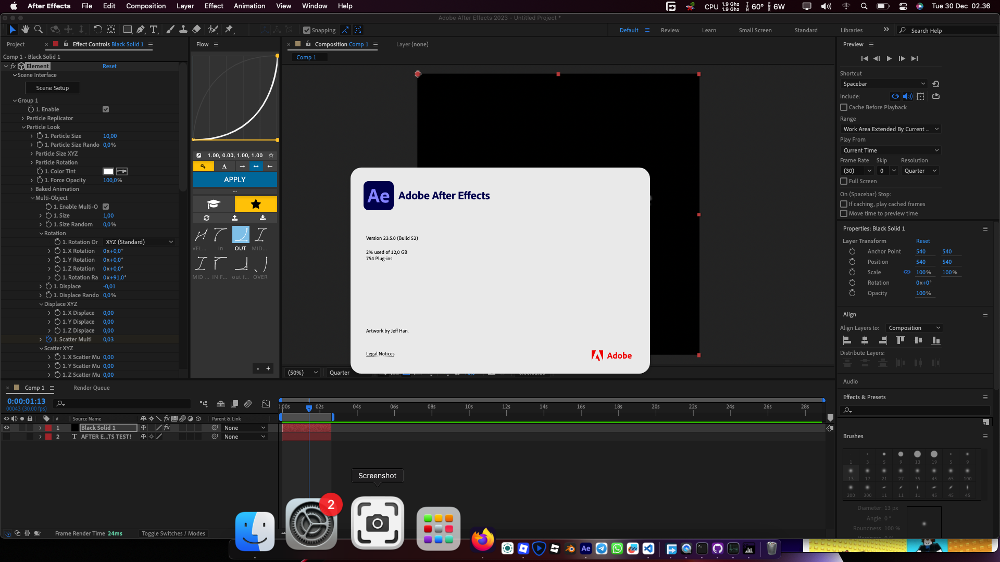
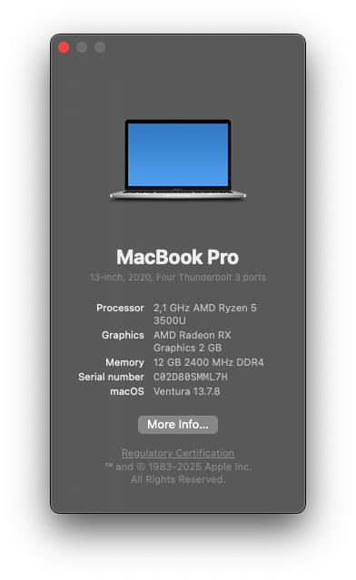
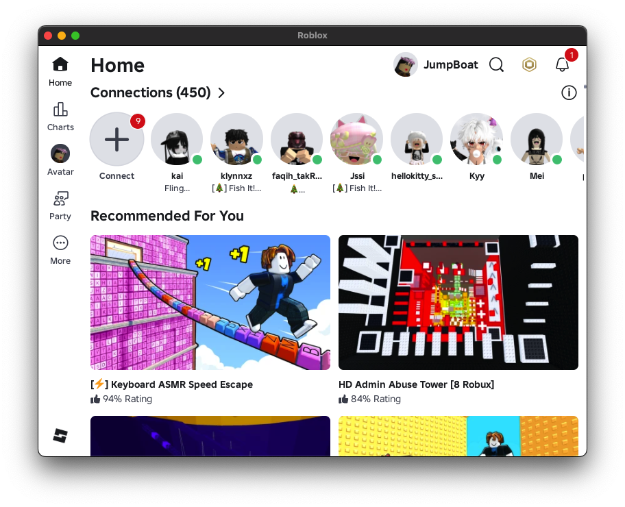
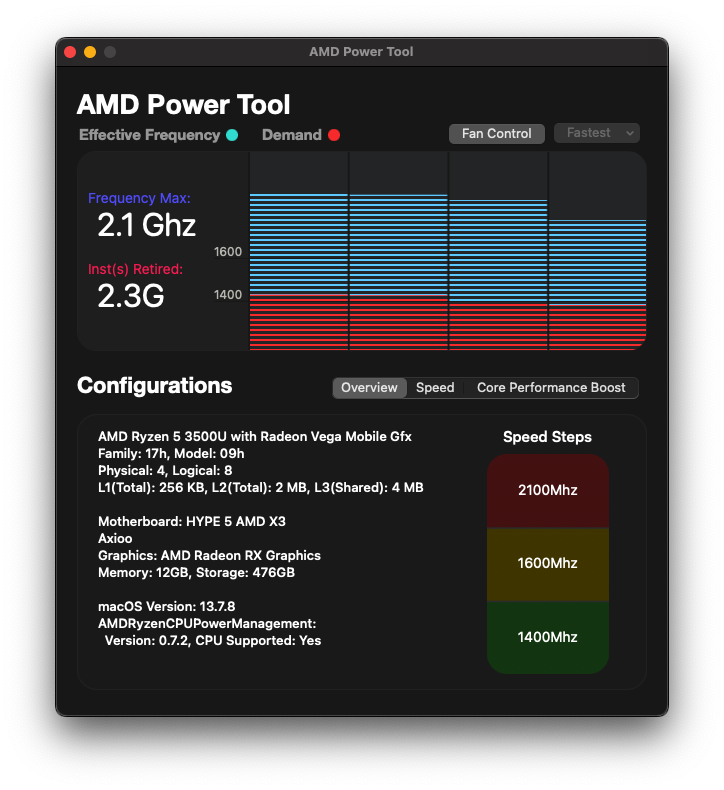

# 🚀 Axioo HYPE 5 AMD X3 — OpenCore EFI

**A stable OpenCore configuration for Axioo HYPE 5 machines**

---

## 📍 Select Language

[🇬🇧 English](#-english) • [🇮🇩 Bahasa Indonesia](#-bahasa-indonesia)

---

## 📸 Screenshots

| After Effects | About Mac |
|:-------:|:-------:|
|  |  |
| Working with Adobe AE | System information & specs |

| Roblox | AMD Power Tool |
|:-------:|:-------:|
|  |  |
| Roblox working without problem | Another Sytem Information |

---

## 🇬🇧 **ENGLISH**

OpenCore EFI configuration for Axioo HYPE 5 with AMD X3 processor. This config enables stable macOS installation and operation.

### 📋 Specs

| Component | Details |
|:----------|:---------|
| **Model** | Axioo HYPE 5 (AMD X3) |
| **CPU** | AMD X3 (4-core) |
| **GPU** | Integrated AMD Radeon Vega 8 |
| **RAM** | 12GB |
| **Storage** | NVMe |

---

### ✅ Working

- ✔️ Boot & System (Big Sur through Ventura)
- ✔️ Graphics / GPU acceleration
- ✔️ USB, keyboard, trackpad, camera
- ✔️ Power management & battery
- ✔️ Adobe After Effects with plugins

### ❌ Not Working (& Fixes Available)

- ✗ **Wi-Fi (onboard)** — Can be fixed with USB Wi-Fi dongle or Android USB tethering
- ✗ **Bluetooth** — No working solution at this time
- ✗ **Audio (onboard)** — Can be fixed with `VoodooHDA` (post-install setup required)

---

### 🔧 Solutions

**Audio**  
Use `VoodooHDA`. Install macOS first, then add `VoodooHDA` afterward. Audio kexts require post-install configuration to work properly.

**Wi-Fi**  
Use a USB Wi-Fi dongle compatible with macOS, or tether from Android via USB.

---

### ⚠️ Important Setup

**BIOS Settings**  
Disable:
- ❌ Fastboot
- ❌ Wake On PCI
- ❌ Secure Boot

**macOS Installation**  
- EFI supports up to macOS Tahoe
- Direct install on versions above Big Sur may cause errors/bootloop
- Recommended: Fresh install from Big Sur, then upgrade via App Store (Big Sur → Monterey → Ventura → etc.)

---

### 📝 Notes

- Tested on Adobe After Effects — works with plugins
- Big Sur performance: upgrade to Monterey/Ventura for better speed
- Currently running macOS Ventura
- Sequoia not tested yet

---

### 🚀 Installation

1. Backup current EFI from target drive
2. Mount EFI partition and replace with EFI folder from this repo
3. Disable BIOS settings listed above
4. Boot from Big Sur USB installer
5. After installation, install additional kexts (e.g., `VoodooHDA`)

See `EFI/` folder for driver and kext details.

---

## 🇮🇩 **BAHASA INDONESIA**

Konfigurasi OpenCore EFI untuk Axioo HYPE 5 dengan prosesor AMD X3. Config ini memungkinkan instalasi dan operasi macOS yang stabil.

### 📋 Spek

| Komponen | Detail |
|:----------|:--------|
| **Model** | Axioo HYPE 5 (AMD X3) |
| **CPU** | AMD X3 (4-core) |
| **GPU** | Integrated AMD Radeon Vega 8 |
| **RAM** | 12GB |
| **Storage** | NVMe |

---

### ✅ Yang Jalan

- ✔️ Boot & System (Big Sur sampai Ventura)
- ✔️ Graphics / GPU acceleration
- ✔️ USB, keyboard, trackpad, camera
- ✔️ Power management & baterai
- ✔️ Adobe After Effects dengan plugins

### ❌ Yang Tidak Jalan (& Ada Cara Fixnya)

- ✗ **Wi-Fi (onboard)** — Bisa diperbaiki dengan dongle Wi-Fi USB atau tethering Android via USB
- ✗ **Bluetooth** — Tidak ada solusi yang working saat ini
- ✗ **Audio (onboard)** — Bisa diperbaiki dengan `VoodooHDA` (setup post-install diperlukan)

---

### 🔧 Cara Atasi

**Audio**  
Gunakan `VoodooHDA`. Install macOS terlebih dahulu, kemudian tambahkan `VoodooHDA` setelahnya. Audio kexts memerlukan konfigurasi post-install untuk bekerja dengan baik.

**Wi-Fi**  
Gunakan dongle Wi-Fi USB yang kompatibel dengan macOS, atau tethering dari Android via USB.

---

### ⚠️ Setup Penting

**BIOS Settings**  
Matikan:
- ❌ Fastboot
- ❌ Wake On PCI
- ❌ Secure Boot

**Instalasi macOS**  
- EFI mendukung sampai macOS Tahoe
- Instalasi langsung di versi di atas Big Sur mungkin menyebabkan error/bootloop
- Disarankan: Fresh install dari Big Sur, kemudian upgrade via App Store (Big Sur → Monterey → Ventura → dst)

---

### 📝 Catatan

- Tested pada Adobe After Effects — bekerja dengan plugins
- Performa Big Sur: upgrade ke Monterey/Ventura untuk performa lebih baik
- Saat ini menggunakan macOS Ventura
- Sequoia belum ditest

---

### 🚀 Instalasi

1. Backup EFI saat ini dari target drive
2. Mount EFI partition dan ganti dengan folder EFI dari repo ini
3. Matikan BIOS settings seperti di atas
4. Boot dari Big Sur USB installer
5. Setelah instalasi, install kext tambahan (e.g., `VoodooHDA`)

Lihat folder `EFI/` untuk detail driver dan kext.
