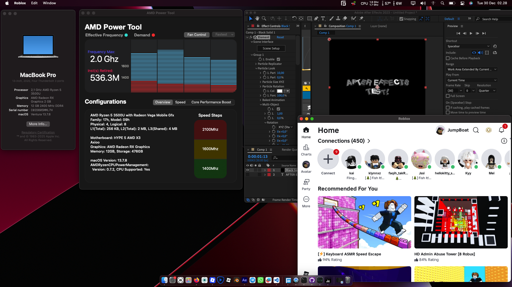
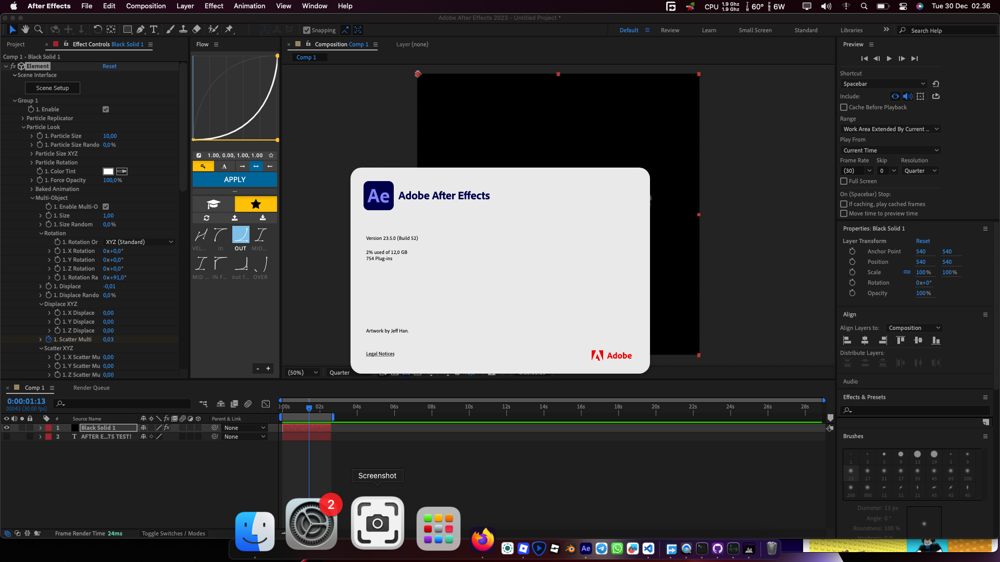
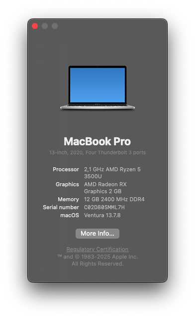
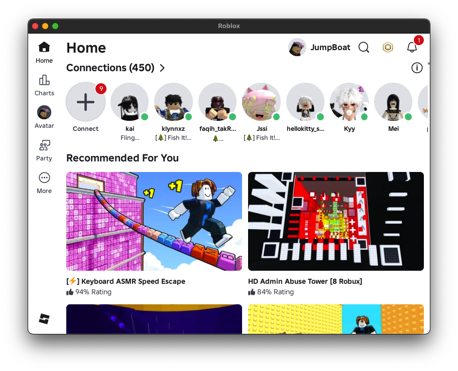
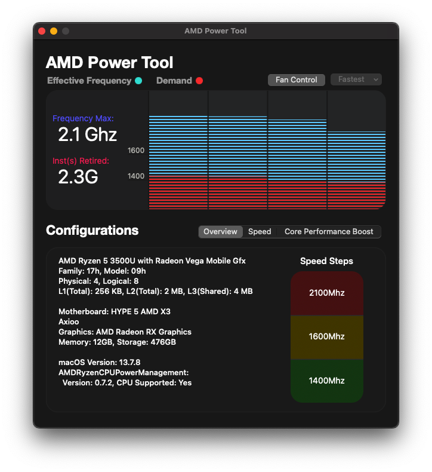

<div align="center">

# Axioo HYPE 5 AMD X3 — OpenCore EFI



[](https://github.com/acidanthera/OpenCorePkg)
[](https://www.apple.com/macos/ventura/)
[](.)

</div>
---

<div align="center">

## 📍 Select Language

[🇬🇧 English](#-english) • [🇮🇩 Bahasa Indonesia](#-bahasa-indonesia)

</div>

---

## 📸 Screenshots

| After Effects | About Mac |
|:---:|:---:|
|  |  |
| Adobe AE working with plugins | System info — macOS Ventura |

| Roblox | AMD Power Tool |
|:---:|:---:|
|  |  |
| Roblox running without issues | CPU power management |

---

## 🇬🇧 English

### 📋 Hardware Specs

| Component | Details |
|:----------|:---------|
| **Laptop** | Axioo HYPE 5 (AMD X3) |
| **CPU** | AMD Ryzen 5 3500U (4C/8T, Picasso) |
| **GPU** | AMD Radeon Vega 8 (iGPU) |
| **RAM** | 12 GB |
| **Storage** | NVMe SSD |
| **Wi-Fi** | Realtek RTW88 (partial support via kext) |
| **Input** | PS/2 Keyboard + I2C Touchpad |
| **SMBIOS** | MacBookPro16,2 |
| **Bootloader** | OpenCore |

---

### ✅ What Works

| Feature | Status | Notes |
|:--------|:------:|:------|
| Boot & macOS | ✅ | Recommended: macOS Ventura |
| GPU Acceleration | ✅ | Via NootedRed (RDNA/Vega iGPU) |
| Keyboard | ✅ | VoodooPS2 |
| Touchpad | ✅ | VoodooI2C + I2C-HID (gestures work) |
| Battery | ✅ | SMCBatteryManager |
| Brightness Keys | ✅ | BrightnessKeys.kext |
| Brightness Control | ✅ | SSDT-PNLF |
| NVMe SSD | ✅ | NVMeFix — ASPM optimised |
| USB | ✅ | USBToolBox with custom mapping |
| CPU Power Mgmt | ✅ | AMDRyzenCPUPowerManagement |
| USB Tethering | ✅ | HoRNDIS (Android USB tethering) |
| **Wi-Fi (onboard)** | ✅ | [Feixiao](https://github.com/thegwchr/Feixiao) (rtw88.kext) + [Starskiff](https://github.com/thegwchr/Starskiff) |
| **Internal Audio** | ✅ | VoodooHDA.kext (post-install via installer) |
| Adobe After Effects | ✅ | Tested with plugins |
| Roblox | ✅ | Runs without issues |

### ❌ Not Working

| Feature | Status | Notes |
|:--------|:------:|:------|
| Sleep / Hibernate | ❌ | Disable sleep — see note below |
| Bluetooth | ❌ | No working solution at this time |
| AirDrop / Handoff | ❌ | Requires native Apple Wi-Fi/BT chip |

> **⚠️ Sleep Note:** Sleep does not work on this configuration. It is recommended to disable sleep entirely:
> ```
> System Settings → Battery → uncheck "Enable Power Nap" and set sleep to "Never"
> ```
> Or via Terminal: `sudo pmset -a sleep 0 disksleep 0`

---

### 🧩 EFI Structure

```
EFI/
└── OC/
    ├── ACPI/          — SSDT patches
    ├── Drivers/       — UEFI drivers
    ├── Kexts/         — Kernel extensions
    ├── Resources/     — OpenCanopy theme assets
    ├── config.plist   — OpenCore configuration
    └── OpenCore.efi
```

---

### 🔌 UEFI Drivers

| Driver | Purpose |
|:-------|:--------|
| `OpenRuntime.efi` | Memory & boot services patches (required) |
| `HfsPlus.efi` | HFS+ filesystem support for macOS volumes |
| `OpenCanopy.efi` | Graphical boot picker (GUI) |
| `ResetNvramEntry.efi` | Adds "Reset NVRAM" option to boot picker |
| `apfs_aligned.efi` | APFS volume driver with alignment fix |

---

### 📂 ACPI SSDTs

| SSDT | Purpose |
|:-----|:--------|
| `SSDT-ALS0` | Fake Ambient Light Sensor — enables brightness control |
| `SSDT-EC` | Fake Embedded Controller — required for USB & macOS boot |
| `SSDT-PLUG` | CPU plugin type — enables power management |
| `SSDT-PNLF` | Panel backlight — enables display brightness |
| `SSDT-RMNE` | Fake Ethernet for NullEthernet — iMessage/FaceTime fix |
| `SSDT-USB-Reset` | USB controller reset for proper port detection |
| `SSDT-USBX` | USB power properties — correct USB power delivery |
| `SSDT-XOSI` | *(Disabled)* OS detection override — not needed currently |

---

### 🧪 Kexts

#### Core / Essential

| Kext | Purpose |
|:-----|:--------|
| `Lilu` | Kernel patcher — required by most other kexts |
| `VirtualSMC` | Fake SMC chip — macOS won't boot without this |
| `AppleMCEReporterDisabler` | Disables MCE reporter — prevents panics on AMD multi-socket |

#### Graphics

| Kext | Purpose |
|:-----|:--------|
| `NootedRed` | AMD Radeon Vega iGPU acceleration (Lilu plugin) |

#### CPU & Power

| Kext | Purpose |
|:-----|:--------|
| `AMDRyzenCPUPowerManagement` | AMD CPU P-state power management |
| `SMCAMDProcessor` | SMC sensors for AMD CPU (VirtualSMC plugin) |
| `ForgedInvariant` | Fixes TSC invariant for AMD — prevents freezes |
| `HibernationFixup` | Fixes hibernation/sleep-wake on AMD |

#### Input

| Kext | Purpose |
|:-----|:--------|
| `VoodooPS2Controller` | PS/2 keyboard & mouse driver |
| `VoodooPS2Keyboard` | PS/2 keyboard subdriver |
| `VoodooPS2Trackpad` | PS/2 trackpad subdriver |
| `VoodooI2C` | I2C bus driver — required for touchpad |
| `VoodooI2CHID` | I2C-HID touchpad support (gestures) |
| `VoodooGPIO` | GPIO pin controller for I2C devices |
| `VoodooI2CServices` | I2C helper services |
| `BrightnessKeys` | Maps Fn+F5/F6 brightness keys |

#### Storage

| Kext | Purpose |
|:-----|:--------|
| `NVMeFix` | NVMe ASPM & power management improvements |

#### USB & Networking

| Kext | Purpose |
|:-----|:--------|
| `USBToolBox` | USB controller framework |
| `UTBDefault` | Custom USB port map for this laptop |
| `HoRNDIS` | Android USB tethering (RNDIS) support |
| `NullEthernet` | Fake Ethernet for iMessage/FaceTime activation |
| `rtw88` | Realtek RTW88 Wi-Fi driver |

#### System

| Kext | Purpose |
|:-----|:--------|
| `SMCBatteryManager` | Battery percentage & status (VirtualSMC plugin) |
| `SMCLightSensor` | Ambient light sensor emulation (VirtualSMC plugin) |
| `RestrictEvents` | Blocks unwanted OS events, enables CPU name spoof |

---

### ⚙️ OpenCore Config Highlights

#### SMBIOS
- **Model:** `MacBookPro16,2` — MacBook Pro 13" 2020 (closest AMD iGPU match)
- **Processor Type:** `1537` (0x0601 — custom AMD type)

#### Boot Args
```
keepsyms=1   — Keep kernel symbols for debugging
npci=0x2000  — PCI bus fix for AMD
vm_compressor=2 — Memory compressor mode
```

#### CPU Name Spoof (via RestrictEvents)
```
revcpuname = AMD Ryzen 5 3500U
```
This makes "About This Mac" show the correct CPU name instead of "Unknown".

#### Kernel Quirks
| Quirk | Value | Reason |
|:------|:-----:|:-------|
| `ProvideCurrentCpuInfo` | ✅ | Required for AMD Ryzen — provides CPU topology info |
| `CustomSMBIOSGuid` | ✅ | Prevents Windows activation issues on dual-boot |
| `PanicNoKextDump` | ✅ | Cleaner panic logs |
| `PowerTimeoutKernelPanic` | ✅ | Prevents panic from slow power state transitions |
| `DisableLinkeditJettison` | ✅ | Improves Lilu compatibility on some macOS versions |

#### Booter Quirks
| Quirk | Value | Reason |
|:------|:-----:|:-------|
| `AvoidRuntimeDefrag` | ✅ | Required for AMD |
| `EnableSafeModeSlide` | ✅ | Safe mode ASLR support |
| `ProvideCustomSlide` | ✅ | ASLR slide value generation |
| `RebuildAppleMemoryMap` | ✅ | Fixes memory map for AMD |
| `SetupVirtualMap` | ✅ | Required for most AMD platforms |
| `SyncRuntimePermissions` | ✅ | Required for newer macOS |

#### Security
- **SecureBootModel:** `Disabled` — Required for AMD Hackintosh
- **Vault:** `Optional` — No file vaulting
- **ScanPolicy:** `0` — Scan all devices

---

### 🔧 Fixes & Tools

#### 📶 Wi-Fi (Working via Feixiao + Starskiff)
Wi-Fi works using [Feixiao](https://github.com/thegwchr/Feixiao) (rtw88.kext) and [Starskiff](https://github.com/thegwchr/Starskiff) as the companion daemon:

- **Double-click** `tools/Install Wifi Driver.tool` in Finder
- Starskiff will be copied to `/Applications` and added to Login Items (auto-starts at login)
- Use **Starskiff** from the menu bar to manage Wi-Fi

#### 🔊 Audio (Working via VoodooHDA)
Internal audio works after installing VoodooHDA:
- **Double-click** `tools/Install Audio Driver.tool` in Finder
- A restart is required after installation
- Audio will appear in **System Settings → Sound**

#### 💤 Sleep (Disabled — Not Working)
Sleep/hibernation does not work on this machine. Disable it to prevent issues:
```bash
sudo pmset -a sleep 0 disksleep 0 hibernatemode 0
```
Or go to **System Settings → Battery** and set sleep timers to **Never**.


---

### ⚠️ BIOS Settings

Before installing, configure BIOS as follows:

**Disable:**
- ❌ Fastboot
- ❌ Wake on PCI-E
- ❌ Secure Boot

**Enable:**
- ✅ UEFI Boot Mode
- ✅ AHCI (for SATA, if applicable)

---

### 🚀 Installation Guide

1. **Download** this EFI from the repo
2. **Generate new serials** using [GenSMBIOS](https://github.com/corpnewt/GenSMBIOS) — do NOT use the included serials
3. **Create macOS USB installer** — **macOS Ventura is recommended**
4. **Mount EFI partition** on your USB drive and paste this EFI folder
5. **Configure BIOS** as listed above
6. **Boot from USB** and install macOS Ventura
7. **Post-install** — open the `tools/` folder and run both installers:

   | Installer | What it does |
   |:----------|:-------------|
   | `Install Wifi Driver.tool` | Installs Feixiao driver + copies **Starskiff.app** to `/Applications` and adds it to Login Items |
   | `Install Audio Driver.tool` | Installs **VoodooHDA.kext** to `/Library/Extensions` and rebuilds kext cache |
8. **Disable sleep** to avoid freeze issues:
   ```bash
   sudo pmset -a sleep 0 disksleep 0 hibernatemode 0
   ```

> **⚠️ Always generate new SMBIOS serials before using this EFI.** Using someone else's serials can get your Apple ID flagged.

---

### 📝 Tested macOS Versions

| Version | Status | Notes |
|:--------|:------:|:------|
| macOS Big Sur (11) | ✅ | Works |
| macOS Monterey (12) | ✅ | Works |
| macOS Ventura (13) | ⭐ **Recommended** | Best stability |
| macOS Sonoma (14) | ⚠️ Not recommended | Same workaround required — disables GPU acceleration |
| macOS Sequoia (15) | ⚠️ Not recommended | Requires [workaround](https://github.com/ChefKissInc/NootedRed/issues/235#issuecomment-4567109847) that disables GPU acceleration — causes lag in video playback and After Effects |
| macOS Tahoe (16) | ⚠️ Not recommended | Same workaround required as Sequoia |

---

### 📚 References

- [OpenCore Install Guide — AMD Laptops](https://dortania.github.io/OpenCore-Install-Guide/AMD/zen.html)
- [NootedRed — AMD iGPU kext](https://github.com/NootInc/NootedRed)
- [AMDRyzenCPUPowerManagement](https://github.com/trulyspinach/SMCAMDProcessor)
- [VoodooI2C](https://voodooi2c.github.io/)
- [Feixiao — RTW88 Wi-Fi Manager](https://github.com/thegwchr/Feixiao)
- [Starskiff — RTW88 Companion Daemon](https://github.com/thegwchr/Starskiff)

---

## 🇮🇩 Bahasa Indonesia

### 📋 Spesifikasi Hardware

| Komponen | Detail |
|:---------|:-------|
| **Laptop** | Axioo HYPE 5 (AMD X3) |
| **CPU** | AMD Ryzen 5 3500U (4C/8T, Picasso) |
| **GPU** | AMD Radeon Vega 8 (iGPU) |
| **RAM** | 12 GB |
| **Storage** | NVMe SSD |
| **Wi-Fi** | Realtek RTW88 (dukungan parsial via kext) |
| **Input** | Keyboard PS/2 + Touchpad I2C |
| **SMBIOS** | MacBookPro16,2 |
| **Bootloader** | OpenCore |

---

### ✅ Yang Berfungsi

| Fitur | Status | Catatan |
|:------|:------:|:--------|
| Boot & macOS | ✅ | Rekomendasi: macOS Ventura |
| Akselerasi GPU | ✅ | Via NootedRed (iGPU Vega) |
| Keyboard | ✅ | VoodooPS2 |
| Touchpad | ✅ | VoodooI2C + I2C-HID (gesture berfungsi) |
| Baterai | ✅ | SMCBatteryManager |
| Tombol Brightness | ✅ | BrightnessKeys.kext |
| Kontrol Kecerahan | ✅ | SSDT-PNLF |
| NVMe SSD | ✅ | NVMeFix — ASPM dioptimasi |
| USB | ✅ | USBToolBox dengan pemetaan custom |
| Power Management CPU | ✅ | AMDRyzenCPUPowerManagement |
| USB Tethering | ✅ | HoRNDIS (tethering Android via USB) |
| **Wi-Fi (onboard)** | ✅ | [Feixiao](https://github.com/thegwchr/Feixiao) (rtw88.kext) + [Starskiff](https://github.com/thegwchr/Starskiff) |
| **Audio Internal** | ✅ | VoodooHDA.kext (install via installer) |
| Adobe After Effects | ✅ | Sudah diuji dengan plugins |
| Roblox | ✅ | Berjalan tanpa masalah |

### ❌ Yang Tidak Berfungsi

| Fitur | Status | Catatan |
|:------|:------:|:--------|
| Sleep / Hibernate | ❌ | Nonaktifkan sleep — lihat catatan di bawah |
| Bluetooth | ❌ | Belum ada solusi yang berfungsi |
| AirDrop / Handoff | ❌ | Butuh chip Wi-Fi/BT Apple asli |

---

### 🧩 Struktur EFI

```
EFI/
└── OC/
    ├── ACPI/          — SSDT patches
    ├── Drivers/       — Driver UEFI
    ├── Kexts/         — Kernel extensions
    ├── Resources/     — Aset tema OpenCanopy
    ├── config.plist   — Konfigurasi OpenCore
    └── OpenCore.efi
```

---

### 🔌 Driver UEFI

| Driver | Fungsi |
|:-------|:-------|
| `OpenRuntime.efi` | Patch memory & boot services (wajib) |
| `HfsPlus.efi` | Dukungan filesystem HFS+ untuk volume macOS |
| `OpenCanopy.efi` | Boot picker grafis (GUI) |
| `ResetNvramEntry.efi` | Tambahkan opsi "Reset NVRAM" di boot picker |
| `apfs_aligned.efi` | Driver volume APFS dengan perbaikan alignment |

---

### 📂 ACPI SSDTs

| SSDT | Fungsi |
|:-----|:-------|
| `SSDT-ALS0` | Sensor cahaya ambient palsu — aktifkan kontrol kecerahan |
| `SSDT-EC` | Embedded Controller palsu — diperlukan untuk USB & boot macOS |
| `SSDT-PLUG` | Plugin type CPU — aktifkan power management |
| `SSDT-PNLF` | Backlight panel — aktifkan brightness layar |
| `SSDT-RMNE` | Ethernet palsu untuk NullEthernet — fix iMessage/FaceTime |
| `SSDT-USB-Reset` | Reset USB controller untuk deteksi port yang benar |
| `SSDT-USBX` | Properti power USB — pengiriman daya USB yang benar |
| `SSDT-XOSI` | *(Dinonaktifkan)* Override deteksi OS |

---

### 🧪 Kexts

#### Core / Wajib

| Kext | Fungsi |
|:-----|:-------|
| `Lilu` | Kernel patcher — dibutuhkan oleh kext lainnya |
| `VirtualSMC` | Chip SMC palsu — macOS tidak akan boot tanpa ini |
| `AppleMCEReporterDisabler` | Nonaktifkan MCE reporter — cegah panic di AMD |

#### Grafis

| Kext | Fungsi |
|:-----|:-------|
| `NootedRed` | Akselerasi GPU iGPU AMD Radeon Vega (plugin Lilu) |

#### CPU & Power

| Kext | Fungsi |
|:-----|:-------|
| `AMDRyzenCPUPowerManagement` | Manajemen daya P-state CPU AMD |
| `SMCAMDProcessor` | Sensor SMC untuk CPU AMD |
| `ForgedInvariant` | Perbaiki TSC invariant AMD — cegah freeze |
| `HibernationFixup` | Perbaiki hibernasi/sleep-wake di AMD |

#### Input

| Kext | Fungsi |
|:-----|:-------|
| `VoodooPS2Controller` | Driver keyboard & mouse PS/2 |
| `VoodooI2C` | Driver bus I2C — diperlukan untuk touchpad |
| `VoodooI2CHID` | Dukungan touchpad I2C-HID (gesture) |
| `BrightnessKeys` | Memetakan tombol Fn+F5/F6 untuk kecerahan |

#### Storage & USB

| Kext | Fungsi |
|:-----|:-------|
| `NVMeFix` | Perbaikan ASPM & power management NVMe |
| `USBToolBox` + `UTBDefault` | Driver USB dengan pemetaan port custom |
| `HoRNDIS` | Tethering USB Android (RNDIS) |
| `NullEthernet` | Ethernet palsu untuk aktivasi iMessage/FaceTime |
| `rtw88` | Driver Wi-Fi Realtek RTW88 |

#### System

| Kext | Fungsi |
|:-----|:-------|
| `SMCBatteryManager` | Persentase & status baterai |
| `SMCLightSensor` | Emulasi sensor cahaya ambient |
| `RestrictEvents` | Blokir event OS yang tidak diinginkan, aktifkan spoof nama CPU |

---

### ⚙️ Highlights Konfigurasi OpenCore

#### Boot Args
```
keepsyms=1    — Simpan simbol kernel untuk debugging
npci=0x2000   — Fix bus PCI untuk AMD
vm_compressor=2 — Mode kompresor memori
```

#### Spoofing Nama CPU
Karena AMD tidak secara native dikenal oleh macOS, `RestrictEvents` digunakan untuk menampilkan nama CPU yang benar di "About This Mac":
```
AMD Ryzen 5 3500U
```

---

### 🔧 Perbaikan & Tools

#### 📶 Wi-Fi (Berfungsi via Feixiao + Starskiff)
Wi-Fi berfungsi menggunakan [Feixiao](https://github.com/thegwchr/Feixiao) (rtw88.kext) dan [Starskiff](https://github.com/thegwchr/Starskiff) sebagai daemon pendamping:

- **Double-click** `tools/Install Wifi Driver.tool` di Finder
- Starskiff akan dicopy ke `/Applications` dan ditambahkan ke Login Items (otomatis berjalan saat login)
- Gunakan **Starskiff** dari menu bar untuk mengatur Wi-Fi

#### 🔊 Audio (Berfungsi via VoodooHDA)
Audio internal berfungsi setelah menginstall VoodooHDA:
- **Double-click** `tools/Install Audio Driver.tool` di Finder
- Restart diperlukan setelah instalasi
- Audio akan muncul di **System Settings → Sound**

#### 💤 Sleep (Dinonaktifkan — Tidak Berfungsi)
Sleep/hibernasi tidak berfungsi. Nonaktifkan untuk menghindari masalah:
```bash
sudo pmset -a sleep 0 disksleep 0 hibernatemode 0
```
Atau via **System Settings → Battery** → atur semua timer sleep ke **Never**.


---

### ⚠️ Pengaturan BIOS

Sebelum instalasi, konfigurasi BIOS sebagai berikut:

**Nonaktifkan:**
- ❌ Fastboot
- ❌ Wake on PCI-E
- ❌ Secure Boot

**Aktifkan:**
- ✅ UEFI Boot Mode

---

### 🚀 Panduan Instalasi

1. **Download** EFI dari repo ini
2. **Generate serial baru** menggunakan [GenSMBIOS](https://github.com/corpnewt/GenSMBIOS) — **jangan gunakan serial yang sudah ada**
3. **Buat USB installer macOS** — **macOS Ventura sangat direkomendasikan**
4. **Mount partisi EFI** di USB dan tempelkan folder EFI ini
5. **Konfigurasi BIOS** seperti yang tercantum di atas
6. **Boot dari USB** dan install macOS Ventura
7. **Post-install** — buka folder `tools/` dan jalankan kedua installer:

   | Installer | Yang dilakukan |
   |:----------|:---------------|
   | `Install Wifi Driver.tool` | Install driver Feixiao + copy **Starskiff.app** ke `/Applications` dan tambahkan ke Login Items |
   | `Install Audio Driver.tool` | Install **VoodooHDA.kext** ke `/Library/Extensions` dan rebuild kext cache |
8. **Nonaktifkan sleep** untuk mencegah freeze:
   ```bash
   sudo pmset -a sleep 0 disksleep 0 hibernatemode 0
   ```

> **⚠️ Selalu generate serial SMBIOS baru sebelum menggunakan EFI ini.** Menggunakan serial orang lain bisa membuat Apple ID kamu terkena flag.

---

### 📝 Versi macOS yang Diuji

| Versi | Status | Catatan |
|:------|:------:|:--------|
| macOS Big Sur (11) | ✅ | Berfungsi |
| macOS Monterey (12) | ✅ | Berfungsi |
| macOS Ventura (13) | ⭐ **Direkomendasikan** | Stabilitas terbaik |
| macOS Sonoma (14) | ⚠️ Tidak direkomendasikan | Workaround yang sama — mematikan GPU acceleration |
| macOS Sequoia (15) | ⚠️ Tidak direkomendasikan | Butuh [workaround](https://github.com/ChefKissInc/NootedRed/issues/235#issuecomment-4567109847) yang mematikan GPU acceleration — menyebabkan lag saat memutar video dan editing di After Effects |
| macOS Tahoe (16) | ⚠️ Tidak direkomendasikan | Workaround yang sama seperti Sequoia |

---

### 📚 Referensi

- [OpenCore Install Guide — AMD Laptops](https://dortania.github.io/OpenCore-Install-Guide/AMD/zen.html)
- [NootedRed — kext iGPU AMD](https://github.com/NootInc/NootedRed)
- [AMDRyzenCPUPowerManagement](https://github.com/trulyspinach/SMCAMDProcessor)
- [VoodooI2C](https://voodooi2c.github.io/)
- [Feixiao — RTW88 Wi-Fi Manager](https://github.com/thegwchr/Feixiao)
- [Starskiff — RTW88 Companion Daemon](https://github.com/thegwchr/Starskiff)

---

<div align="center">

*Made with ❤️ — Axioo HYPE 5 Hackintosh by hype5x3*

</div>
